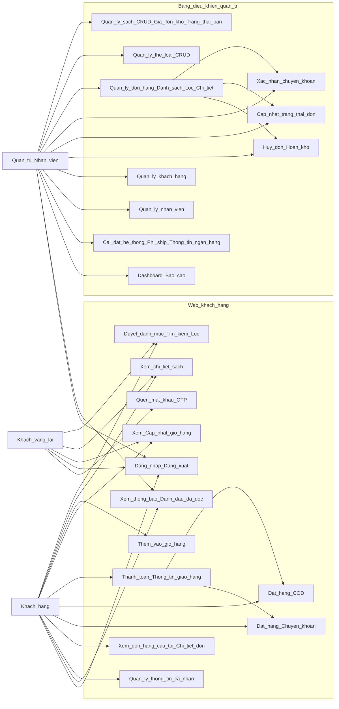
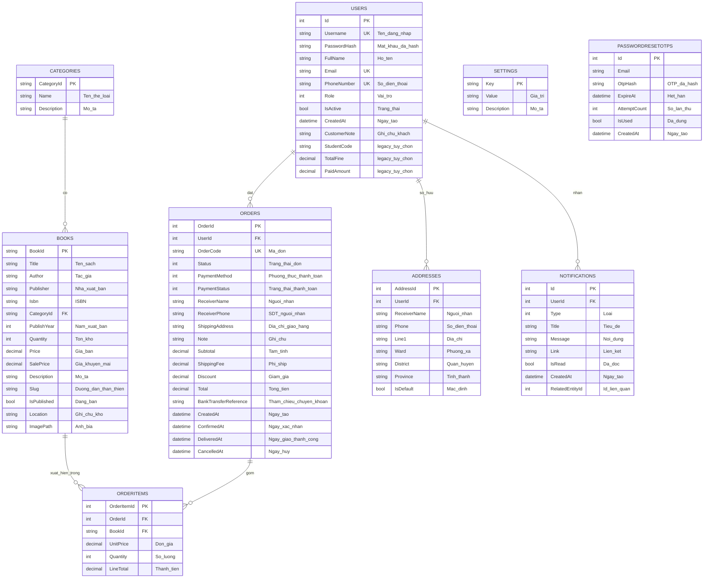

# Kế hoạch – Cửa hàng sách online (Use Case + ERD)

## Use Case tổng quát

```mermaid
flowchart LR
  Guest[Khach_vang_lai]
  Customer[Khach_hang]
  Admin[Quan_tri_Nhan_vien]

  subgraph ClientApp [Web_khach_hang]
    UC_Browse[Duyet_danh_muc_Tim_kiem_Loc]
    UC_ViewProduct[Xem_chi_tiet_sach]
    UC_AddCart[Them_vao_gio_hang]
    UC_ViewCart[Xem_Cap_nhat_gio_hang]
    UC_Checkout[Thanh_toan_Thong_tin_giao_hang]
    UC_PlaceCOD[Dat_hang_COD]
    UC_PlaceBank[Dat_hang_Chuyen_khoan]
    UC_TrackOrders[Xem_don_hang_cua_toi_Chi_tiet_don]
    UC_Login[Dang_nhap_Dang_xuat]
    UC_Profile[Quan_ly_thong_tin_ca_nhan]
    UC_Forgot[Quen_mat_khau_OTP]
    UC_Notifications[Xem_thong_bao_Danh_dau_da_doc]
  end

  subgraph AdminApp [Bang_dieu_khien_quan_tri]
    UC_AdminBooks[Quan_ly_sach_CRUD_Gia_Ton_kho_Trang_thai_ban]
    UC_AdminCategories[Quan_ly_the_loai_CRUD]
    UC_AdminOrders[Quan_ly_don_hang_Danh_sach_Loc_Chi_tiet]
    UC_ConfirmTransfer[Xac_nhan_chuyen_khoan]
    UC_UpdateOrderStatus[Cap_nhat_trang_thai_don]
    UC_CancelOrder[Huy_don_Hoan_kho]
    UC_AdminCustomers[Quan_ly_khach_hang]
    UC_AdminStaff[Quan_ly_nhan_vien]
    UC_Settings[Cai_dat_he_thong_Phi_ship_Thong_tin_ngan_hang]
    UC_Dashboard[Dashboard_Bao_cao]
  end

  Guest --> UC_Browse
  Guest --> UC_ViewProduct
  Guest --> UC_ViewCart
  Guest --> UC_Login
  Guest --> UC_Forgot

  Customer --> UC_Browse
  Customer --> UC_ViewProduct
  Customer --> UC_AddCart
  Customer --> UC_ViewCart
  Customer --> UC_Checkout
  Customer --> UC_PlaceCOD
  Customer --> UC_PlaceBank
  Customer --> UC_TrackOrders
  Customer --> UC_Profile
  Customer --> UC_Notifications
  Customer --> UC_Login

  Admin --> UC_AdminBooks
  Admin --> UC_AdminCategories
  Admin --> UC_AdminOrders
  Admin --> UC_ConfirmTransfer
  Admin --> UC_UpdateOrderStatus
  Admin --> UC_CancelOrder
  Admin --> UC_AdminCustomers
  Admin --> UC_AdminStaff
  Admin --> UC_Settings
  Admin --> UC_Dashboard
  Admin --> UC_Notifications
  Admin --> UC_Login

  UC_Checkout --> UC_PlaceCOD
  UC_Checkout --> UC_PlaceBank
  UC_AdminOrders --> UC_ConfirmTransfer
  UC_AdminOrders --> UC_UpdateOrderStatus
  UC_AdminOrders --> UC_CancelOrder
```

## ERD (Sơ đồ thực thể – quan hệ)

```mermaid
erDiagram
  USERS {
    int Id PK
    string Username UK "Ten_dang_nhap"
    string PasswordHash "Mat_khau_da_hash"
    string FullName "Ho_ten"
    string Email UK
    string PhoneNumber UK "So_dien_thoai"
    int Role "Vai_tro"
    bool IsActive "Trang_thai"
    datetime CreatedAt "Ngay_tao"
    string CustomerNote "Ghi_chu_khach"
    string StudentCode "legacy_tuy_chon"
    decimal TotalFine "legacy_tuy_chon"
    decimal PaidAmount "legacy_tuy_chon"
  }

  CATEGORIES {
    string CategoryId PK
    string Name "Ten_the_loai"
    string Description "Mo_ta"
  }

  BOOKS {
    string BookId PK
    string Title "Ten_sach"
    string Author "Tac_gia"
    string Publisher "Nha_xuat_ban"
    string Isbn "ISBN"
    string CategoryId FK
    int PublishYear "Nam_xuat_ban"
    int Quantity "Ton_kho"
    decimal Price "Gia_ban"
    decimal SalePrice "Gia_khuyen_mai"
    string Description "Mo_ta"
    string Slug "Duong_dan_than_thien"
    bool IsPublished "Dang_ban"
    string Location "Ghi_chu_kho"
    string ImagePath "Anh_bia"
  }

  ORDERS {
    int OrderId PK
    int UserId FK
    string OrderCode UK "Ma_don"
    int Status "Trang_thai_don"
    int PaymentMethod "Phuong_thuc_thanh_toan"
    int PaymentStatus "Trang_thai_thanh_toan"
    string ReceiverName "Nguoi_nhan"
    string ReceiverPhone "SDT_nguoi_nhan"
    string ShippingAddress "Dia_chi_giao_hang"
    string Note "Ghi_chu"
    decimal Subtotal "Tam_tinh"
    decimal ShippingFee "Phi_ship"
    decimal Discount "Giam_gia"
    decimal Total "Tong_tien"
    string BankTransferReference "Tham_chieu_chuyen_khoan"
    datetime CreatedAt "Ngay_tao"
    datetime ConfirmedAt "Ngay_xac_nhan"
    datetime DeliveredAt "Ngay_giao_thanh_cong"
    datetime CancelledAt "Ngay_huy"
  }

  ORDERITEMS {
    int OrderItemId PK
    int OrderId FK
    string BookId FK
    decimal UnitPrice "Don_gia"
    int Quantity "So_luong"
    decimal LineTotal "Thanh_tien"
  }

  ADDRESSES {
    int AddressId PK
    int UserId FK
    string ReceiverName "Nguoi_nhan"
    string Phone "So_dien_thoai"
    string Line1 "Dia_chi"
    string Ward "Phuong_xa"
    string District "Quan_huyen"
    string Province "Tinh_thanh"
    bool IsDefault "Mac_dinh"
  }

  SETTINGS {
    string Key PK
    string Value "Gia_tri"
    string Description "Mo_ta"
  }

  NOTIFICATIONS {
    int Id PK
    int UserId FK
    int Type "Loai"
    string Title "Tieu_de"
    string Message "Noi_dung"
    string Link "Lien_ket"
    bool IsRead "Da_doc"
    datetime CreatedAt "Ngay_tao"
    int RelatedEntityId "Id_lien_quan"
  }

  PASSWORDRESETOTPS {
    int Id PK
    string Email
    string OtpHash "OTP_da_hash"
    datetime ExpireAt "Het_han"
    int AttemptCount "So_lan_thu"
    bool IsUsed "Da_dung"
    datetime CreatedAt "Ngay_tao"
  }

  CATEGORIES ||--o{ BOOKS : "co"
  USERS ||--o{ ORDERS : "dat"
  ORDERS ||--o{ ORDERITEMS : "gom"
  BOOKS ||--o{ ORDERITEMS : "xuat_hien_trong"
  USERS ||--o{ ADDRESSES : "so_huu"
  USERS ||--o{ NOTIFICATIONS : "nhan"
```

